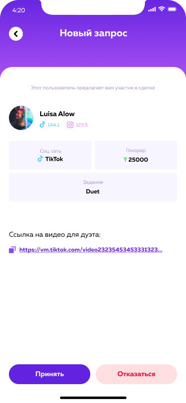

# Сделки

Сделки - это модуль в котором пользователи могу как создавать, так и принимать сделки.

1. Тикток
  - сделка - Дуэт
  - сделка - Звук
  - сделка - Сшивание
  - сделка - Видео

2. Инстаграм
  - сделка - Пост
  - сделка - Сторис
  - сделка - Взаимопиар

## Input/Output data

Модель -  `Input data - deals/tiktok`:

| Наименование                                 | Параметр       | Тип     |
| -------------------------------------------- | ------------   | ----    |
| Исполнитель                                  | executor       | uuid    |
| Тип соц.сети                                 | social_network_type| string  |
| Тип задания                                  | task_type      | string  |
| Гонорар                                      | fee            | int     |
| Ссылка на тикток                             | tiktok_task_link     | string  |

```md title="Типы"
Тип соц.сети
  - TIK_TOK
Тип задания 
  - DUET
  - STICH
  - SOUND
  - VIDEO
```
Endpoint в swagger [https://dev.behype.club/api/v1/deals](https://dev.behype.club/api/v1/deals).

Модель -  `Output data - deals/tiktok`:

| Наименование                                 | Параметр       | Тип     |
| -------------------------------------------- | ------------   | ----    |
| id сделки                                    | uuid           | string($uuid)|
| Пользователь                                 | user           | string    |
| Статус                                       | status         | string    |
| Тип соц.сети                                 | social_network_type| string  |
| Тип задания                                  | task_type      | string  |
| Гонорар                                      | fee            | int     |
| Ссылка на тикток                             | tiktok_task_link     | string  |

```md title="Статус" 
- PENDING
- ACTION
- CONTROL
- FAILED
- SUCCESS
- REJECTED
- NOT_APPROVED
- PAYMENT
- FROZEN
- WAITING_FILES
```
Endpoint в swagger [https://dev.behype.club/api/v1/deals](https://dev.behype.club/api/v1/deals).


Модель -  `Input data - deals/instagram`:

| Наименование                                 | Параметр       | Тип     |
| -------------------------------------------- | ------------   | ----    |
| Исполнитель                                  | executor       | uuid    |
| Тип соц.сети                                 | social_network_type| string  |
| Тип задания                                  | task_type      | string  |
| Гонорар                                      | fee            | int     |

```md title="Типы"
Тип соц.сети
  - INSTAGRAM
Тип задания 
  - POST
  - STORIES
  - MUTUAL_PR
```
Endpoint в swagger [https://dev.behype.club/api/v1/deals](https://dev.behype.club/api/v1/deals).

Модель -  `Output data - deals/instagram`:

| Наименование                                 | Параметр       | Тип     |
| -------------------------------------------- | ------------   | ----    |
| id сделки                                    | uuid           | string($uuid)|
| Пользователь                                 | user           | string    |
| Статус                                       | status         | string    |
| Тип соц.сети                                 | social_network_type| string  |
| Тип задания                                  | task_type      | string  |
| Гонорар                                      | fee            | int     |

```md title="Статус" 
- PENDING
- ACTION
- CONTROL
- FAILED
- SUCCESS
- REJECTED
- NOT_APPROVED
- PAYMENT
- FROZEN
- WAITING_FILES
```
Endpoint в swagger [https://dev.behype.club/api/v1/deals](https://dev.behype.club/api/v1/deals).

## Roles:
 - Отправитель
 - Исполнитель

## User story - Опратвитель (в дальнейшем пользователь отправитель "П/О")

Я как П/О могу создать сделку с интересующим меня блогером
Сделки могу создать как для Instagram, так и для TIKTOK, для этого необходимо:
1. Перейти в профиль исполнителя
2. Выбрать соц. сети в которой исполнитель примет сделку
3. Выбрать тип сделки с соответиствием социальной сети
4. Произвести оплату, либо же предложить исполнителю гонорар

После того как создали сделку, деньги списываются с баланса и есть 2 пути исхода:
 - Принятие сделки
 - Отклонение сделки

 

Если исполнитель принял сделку и выполнили все шаги, то деньги уходят на баланс исполнителя
Если исполнитель оклонил запрос, не правильно выполнил задание, не успел по времени выполнить, то деньги вернутся на баланс отправилтеля

## User story - Исполнитель (в дальнейшем пользователь исполнитель "П/И")

Я как П/И могу увидеть сделки которые ко мне приходят от пользователей, данные уведомления я могу просмотреть в модуле сделок(Полученные)

Если меня устраивает гонорар и задание, то я принимаю сделку, в дальнейшем от меня требуется выполнение всех шагов в сделке, а именно:

1. Загрузить ссылку
2. Загрузить статистику

После пройденных шагов, я ожидаю действия от отправителя, чтобы от дал поддтверждение
Далее когда придет поддверждение, на баланс поступят деньги

