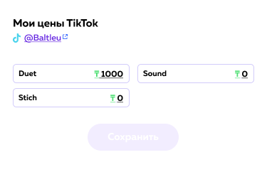

# Профиль

В данном модуле описывается профиль пользователя

Здесь фиксируется вся информация о пользователе а именно:
- `Фотография пользователя`
- `Подключенные соц. сети`
- `Описание`
- `Категории`
- `Статистика`

- `Цены сделки с данным пользователем`

- `Баланс`

## Input/Output data

Модель -  `user/me`:

| Наименование                                 | Параметр       | Тип     |
| -------------------------------------------- | ------------   | ----    |
| Id                                           | UUID           | string  |
| Телефон                                      | phone          | string  |
| Email                                        | email          | string  |
| Имя пользователя                             | username       | string  |
| Имя                                          | first_name     | string  |
| Фамилия                                      | last_name      | string  |
| Баланс                                       | balance        | int     |
| Дата рождения                                | birth_date     | date    |
| Город                                        | city           | string  |
| Пол                                          | gender         | string  |
| Информация о пользователе                    | information    | string  |
| Аватар                                       | avatar         | string  |
| Категории                                    | categories     | dict    |
| Подтверждение email                          | email_confirmed| boolean |
| Tiktok                                       | tiktok         | dict    |
| Instagram                                    | instagram      | dict    |   
| Подключение инстаграмма                      | instagram_connected| boolean    |
| Подключение тиктока                          | tiktok_connected | boolean |
| Взаимопиар                                   | mutual_pr_agreement| dict    |                      

## User story - Пользователь

Я как пользователь скачавший приложение Behype,захожу в раздел "Профиль", после регистрации я начинаю заполнять свой профиль (некоторые необязательные поля могут быть пустыми)

1. Заполняю имя и фамилию
2. Подключаю соц.сети
3. Проставляю цены для сделок со мной
4. Добавляю описание
5. Добавляю категории

После этого я могу совершать :

1. Сделки с другими пользователям
2. Учавствовать/Создавать челленджи
3. Люди могут меня найти по интересам
